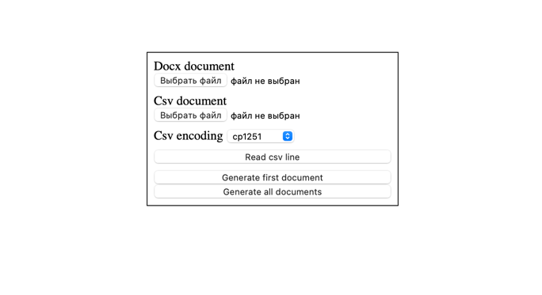

# Шаблонизатор документов Word

## Создание шаблона

В документе в фигурные скобки `{}` добавляем необходимые поля для вставки, __с большой буквы и без пробелов__, пробелы заменяем символом нижнего подчеркивания `_`

## Создание csv файла при помощи excel

Необходимо подготовить нашу таблицу, в 1 строке таблицы находятся шаблонные поля которые мы указывали в `{}` в вордовском документе.

Одна строка с данными равняется одному полученному ворд документу.

Когда закончили работу с таблицей, делаем экспорт страницы в `CSV UTF-8` формат и сохраняем.

## Как воспользоваться шаблонизатором

### Запускаем шаблонизатор

Для запуска необходимо кликнуть дважды по файлу `start.bat`

### Выбираем документы

1. В `Docx document` выбираем docx документ с шаблоном
2. В `Csv document` выбираем csv документ
3. Нажимаем `Submit`
4. На скачивание уйдет zip файл, в котором будут содержаться все созданые ворд документы     